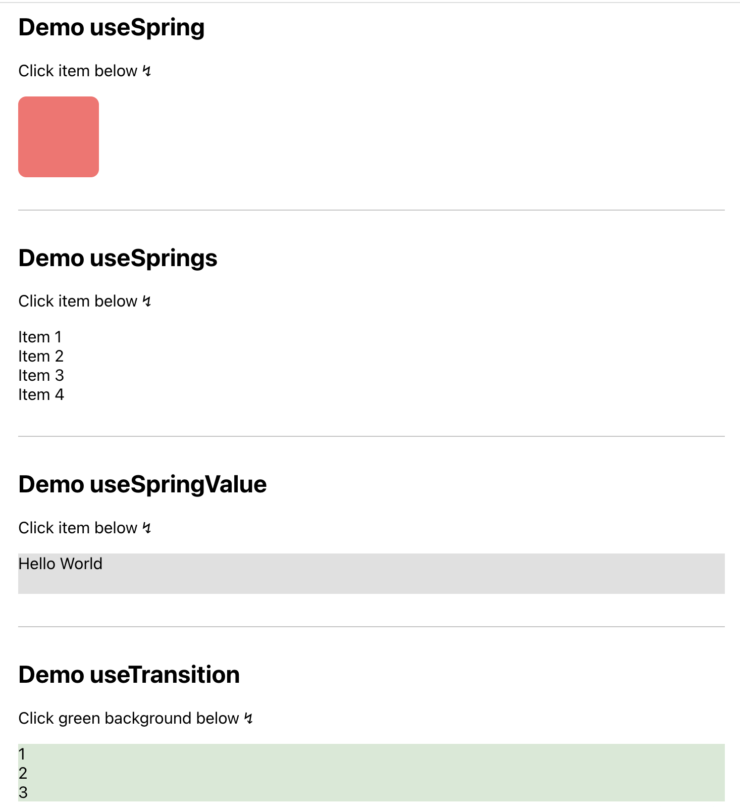
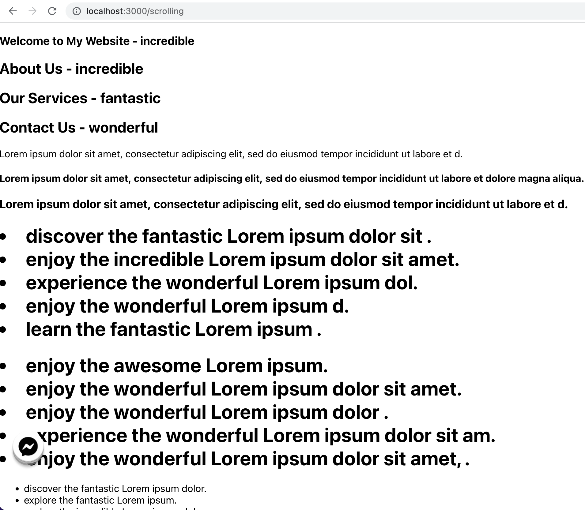

## DEMO REACT SPRING - ANIMATION LIBRARY

Run in develop env:

```
 npm start
```

### 1. URL: /

→ Demo some hooks: `useSpring`, `useSprings`, `useSpringValue`, `useTransition`.
Preference: [React Spring](https://www.react-spring.dev/docs/components/use-spring)



### 2. URL: /scrolling

→ scroll to the bottom, you can see animation applied to main element.

